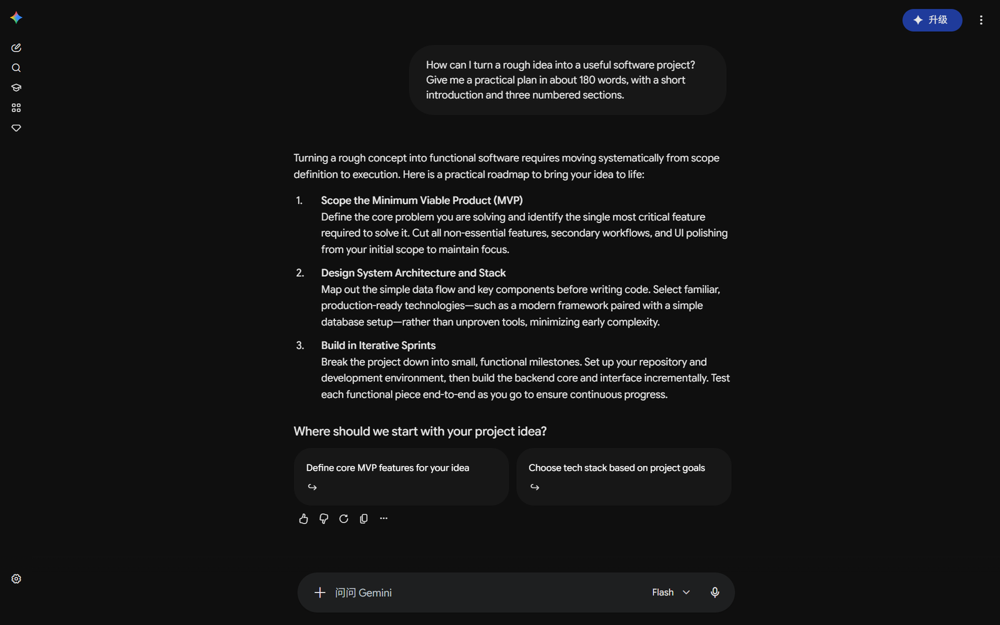
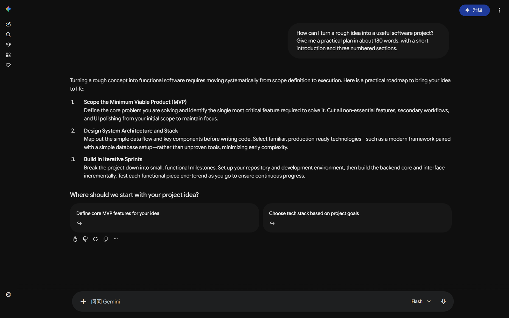

[English](./README.md) | 简体中文 | [繁體中文](./docs/i18n/README.zh-TW.md)

# Wider Gemini

一个用来调整 Gemini 对话宽度的 Chrome 扩展。拖动滑块或点选预设，就能把对话区调到适合自己屏幕的大小。

[](https://chromewebstore.google.com/detail/apadogadaahdjhhmbdhkmdecbobijoed?utm_source=github&utm_medium=readme&utm_campaign=zh-cn)
[](https://github.com/Planetes1mal/wider-gemini/releases/tag/v2.8.0)
[](./LICENSE)

同一段完整的 Gemini 对话、同样的窗口大小：使用 Wider Gemini 将对话宽度分别设为 700px 和 1200px。





## 功能

- **调整宽度**：按像素（`px`）或窗口比例（`%`）设置，也可以保存常用预设。
- **调整字号和间距**：字号支持 75%–200%，行高和段落间距可以单独设置。
- **代码自动换行**：长代码在对话区内折行显示。
- **用户消息铺满宽度**：让自己的消息和 Gemini 的回答一样，左对齐并使用完整的对话宽度。
- **界面语言**：英文、简体中文、繁体中文、韩语、日语和西班牙语。默认跟随浏览器，也能手动选择。韩语、日语和西班牙语采用机器辅助翻译，欢迎母语者改进。

设置会自动保存，调整后立即应用到已打开的 Gemini 页面。

## 安装

在 [Chrome 应用商店](https://chromewebstore.google.com/detail/apadogadaahdjhhmbdhkmdecbobijoed?utm_source=github&utm_medium=readme&utm_campaign=zh-cn)点击 **添加至 Chrome** 即可安装。

GitHub 版本与 Chrome 应用商店的更新时间可能不同。若要使用 2.8.0，请按下方方式安装对应的 GitHub 正式版。

<details>
<summary>手动安装</summary>

1. 到 [GitHub Releases](https://github.com/Planetes1mal/wider-gemini/releases) 下载最新正式版的 `wider-gemini-*.zip`。
2. 解压到一个固定位置，确认文件夹里有 `manifest.json`。
3. 打开 `chrome://extensions/`，开启右上角的 **开发者模式**。
4. 点击 **加载已解压的扩展程序**，选择刚才解压的文件夹。

若曾手动安装 2.8.0 候选版，请替换文件并重新加载扩展，以使用正式版；候选版不会自动升级为此版本。

</details>

## 使用

1. 打开 [Gemini](https://gemini.google.com/)，点击浏览器工具栏里的 Wider Gemini 图标。
2. 选择 `px` 或 `%`，拖动宽度滑块，也可以直接点一个预设。
3. 根据需要调整字号、阅读密度，或开启代码自动换行。

在 **管理预设** 中可以修改预设名称和宽度；`px` 和 `%` 各有一组独立预设。界面语言在弹窗底部切换。

使用长文阅读、表格、代码和大字四种**任务预设**时，先查看设置摘要，再点击应用；**恢复之前的设置**可以在本机恢复应用前的版式，关闭弹窗后仍可使用。具体数值及恢复范围见[阅读指南](./docs/guides/reading-layout.md)。

弹窗底部的 **帮助与反馈** 提供排查说明，也可以预览并复制诊断设置。扩展支持 Gemini 网页和通过 Chrome 安装的网站应用窗口，不会修改原生桌面应用或 Chrome 内置的 Gemini 面板。

## 隐私

扩展只在 `gemini.google.com` 上调整页面样式，不收集或上传对话内容，也没有统计或追踪服务。

偏好设置通过 Chrome 的扩展存储保存；是否跨设备同步取决于你的浏览器同步设置。详见[隐私说明](./docs/PRIVACY.md)。

## 本地开发

项目使用原生 JavaScript、HTML 和 CSS，无需安装依赖或构建。

```bash
git clone https://github.com/Planetes1mal/wider-gemini.git
```

在 `chrome://extensions/` 开启 **开发者模式**，点击 **加载已解压的扩展程序**，选择仓库文件夹。修改代码后，重新加载扩展并刷新 Gemini 页面。

内部迭代可运行 `node scripts/test.js --skip-packaging`，执行已有单元检查而不生成 ZIP。浏览器与发布检查见[贡献指南](./CONTRIBUTING.md)，版式规则见[工程与兼容性说明](./docs/engineering.md)。

[带日期的兼容性记录](./docs/compatibility.md)区分源码实测和待验证设备。运行 `node scripts/reading-lab.js` 可打开[本地阅读实验](./docs/lab/README.md)，比较正文与表格的两种宽度安排；它独立于扩展。

## 反馈与贡献

遇到问题，可在弹窗的 **帮助与反馈** 中复制诊断设置，并附上操作步骤提交 [Issue](https://github.com/Planetes1mal/wider-gemini/issues/new/choose)。分享截图前请移除私人信息。欢迎提交 Pull Request。

如果 Wider Gemini 对你有帮助，可以在 GitHub 点一个 Star，让更多人发现它。

Star 完全自愿。想接收版本通知，请使用仓库的 **Watch → Custom → Releases** 设置，参见 [GitHub 通知说明](https://docs.github.com/en/subscriptions-and-notifications/get-started/configuring-notifications)。

本项目采用 [MIT 协议](./LICENSE)。
