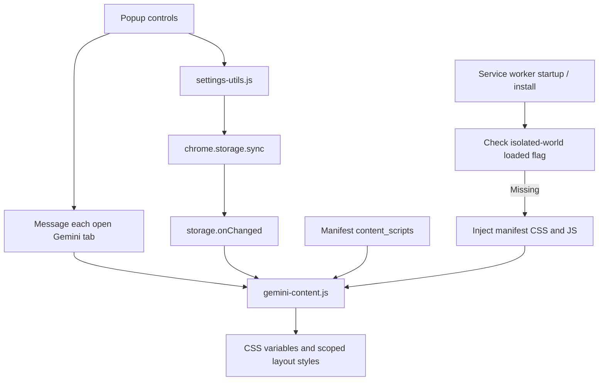

# Engineering and compatibility

Wider Gemini adjusts the reading layout of `gemini.google.com`. It is a Manifest V3 extension with no runtime dependencies, server, or build step. Its source, tests, and release packager are kept together so layout fixes can be reproduced.

## Implementation case studies

- [Recovering a missed content-script injection at browser startup](./engineering/pwa-cold-start.md): the worker's recovery path, two initialization guards, and the limits of mocked lifecycle checks.
- [Keeping Drive overlays outside conversation width rules](./engineering/drive-overlay-width.md): the historical selector failure, current input boundaries, and the existing browser fixture's protected-overlay assertions.
- [Performance checks](./performance.md): the measurement method, recorded local baseline, and limits of synthetic performance evidence.
- [Measuring layout regressions in a real browser](./engineering/browser-regressions.md): geometry assertions, one focused caption reproduction, and the boundaries between fixture and live-site evidence.
- [From a compatibility report to a traceable release](./engineering/report-to-release.md): minimal reproductions, candidate versions, exact release notes, and the existing publication gate.

These articles explain code and reproducible checks. They do not claim new live-site or cross-platform verification.

The dated [compatibility record](./compatibility.md) lists what was actually checked, what failed before measurement, and which real-device checks remain open. The separate [reading lab](./lab/README.md) explores mixed prose/table widths without changing production selectors.

## Settings and injection



`settings-utils.js` normalizes stored widths, units, presets, density, text size, and language. The popup persists settings and sends updates to open Gemini tabs; the content script also observes storage changes. Both paths can deliver the same setting, so applying a setting must be harmless when repeated. A page reload is a fallback for a tab without a receiving content script.

Normally Chrome injects the manifest's content scripts on navigation. During browser or installed-site app startup, a page can be ready before the extension. `background.js` checks `window.widerGeminiContentLoaded` in the extension's isolated world and injects the manifest's CSS and JS only when missing. Discarded tabs are skipped. The content script guards both re-execution and initialization, so a repeated injection or a second load event does not install duplicate observers.

The extension requests `storage`, `scripting`, and access to `gemini.google.com`; startup injection does not require the browsing-history `tabs` permission. See [manifest.json](../manifest.json), [background.js](../background.js), and [gemini-content.js](../gemini-content.js).

## Layout boundaries

Gemini can limit width at several nested message containers. Changing the outer container alone can leave text, tables, or code narrow. Fixes therefore need to account for the content subtree while preserving unrelated UI.

- Keep the `input-container` outer shell at full width. Apply `--gemini-chat-width` to its inner `.input-area-container` and `input-area-v2` elements.
- Scope upload-card and file-drop-area rules beneath that input shell, inheriting the constrained inner width.
- Do not add global width overrides to `.cdk-overlay-pane`, `.mat-menu-panel`, or `[role="dialog"]`. Drive pickers and menus must retain their own layout.
- Apply sidenav overflow and height overrides only on chat pages. Notebook landing pages need their normal vertical flow.
- Retain the response-container compatibility selectors introduced for Gemini's updated layouts. An unverified synthetic structure alone is not grounds to remove a fix that users need.

The [2.5.0 release](../CHANGELOG.md) documents the startup and duplicate-initialization fixes. [PR #10](https://github.com/Planetes1mal/wider-gemini/pull/10) and the 2.6.0 release document the later message-width compatibility work.

## Reproduce the automated checks

Internal checks require Node.js 24, plus Chrome for browser checks. No npm packages or release ZIP are required.

```sh
node scripts/test.js --skip-packaging
node tests/e2e/message-width.js
```

`WG_CHROME` selects the browser executable; the local default is Chrome's standard Windows installation path. The layout script prints the temporary fixture directory and retains the synthetic HTML and measurements for inspection.

For full release validation, `node scripts/test.js` also runs packaging tests and therefore needs PowerShell 7 or Windows PowerShell 5.1. `WG_POWERSHELL` selects PowerShell; the default is `powershell.exe` on Windows and `pwsh` elsewhere. CI retains this full suite, using Node 24, Windows PowerShell on the Windows runner, and its preinstalled Google Chrome. The layout step resolves Chrome's registered application path and prints its actual version. Release ZIP creation remains a separate Ubuntu job using PowerShell 7.

| Check | What it establishes |
|---|---|
| `settings-utils.test.js` | Settings normalization and fallbacks |
| `gemini-content-css.test.js` | Required scoped selectors and declarations |
| `gemini-content-lifecycle.test.js` | Single initialization, repeated injection, and late injection |
| `background.test.js` | Check-before-inject, manifest permissions, discarded tabs, and per-tab failures |
| `release-package.test.js` (full suite only) | RC/stable tags, exact release notes, ZIP allowlist, and failed-build behavior |
| `e2e/message-width.js` | Real-browser measurements on synthetic message trees: px/%, nested width limits, late messages, tables, code wrapping, images, input, and protected overlay content |

The Tests workflow runs these checks on PRs and pushes to `main`. The Release workflow calls the same workflow and publishes only after it passes. These checks exercise local fixtures and mocked extension APIs, not a signed-in Gemini account.

The public layout fixture retains the overlay/menu and message-width checks. It excludes two earlier experimental assumptions about fixed-width wrapper shells around nested dialog markup: those structures were not confirmed in a real Gemini failure, so preserving their arbitrary widths is not a release requirement. A reproduced live-page regression would be evaluated on its own evidence.

Two additional existing scripts can load the source directory directly:

```sh
node tests/e2e/package-load.js .
node tests/e2e/popup-language.js . archive/popup-language-check
```

These commands do not build a ZIP. Package-load checks extension loading, the manifest, and popup localization; popup-language checks the localized popup and captures diagnostic screenshots in the ignored archive. They use isolated browser profiles and require a Chrome version supporting the extension debugging APIs they invoke. They are optional local checks, separate from the CI layout test. When validating an actual release package, substitute its extracted directory for `.`.

## Manual compatibility checklist

For a layout release, record the date, extension version, browser version, OS, and outcome for the flows actually tested. The table below is a checklist, not a claim that each flow has just passed on every platform.

| Flow | Expected result |
|---|---|
| Regular chat and editing a question | Messages and input align; edited text remains visible |
| Long code, wide tables, and images | Width applies; wrapping/scrolling controls work; image proportions are preserved |
| Notebook Sources and file attachment | Sources is reachable; input growth does not cover landing content |
| Add from Drive | Picker content and Add button remain visible |
| Local file drag-and-drop | Input and message width remain stable |
| Deep Research | The existing 1600px override still applies |
| Settings changes in multiple tabs | Changes apply without a reload; values persist after reload |
| Chrome-installed Gemini site app after quitting Chrome | Layout applies on cold start without a manual refresh |

The Chrome-installed site app is a PWA window. It is distinct from Google's native desktop Gemini applications and Chrome's built-in Gemini panel; the manifest only targets Gemini webpages. Synthetic checks cannot prove compatibility with a new live DOM rollout, so useful reports include the page type and a minimal reproduction using non-sensitive sample content.
