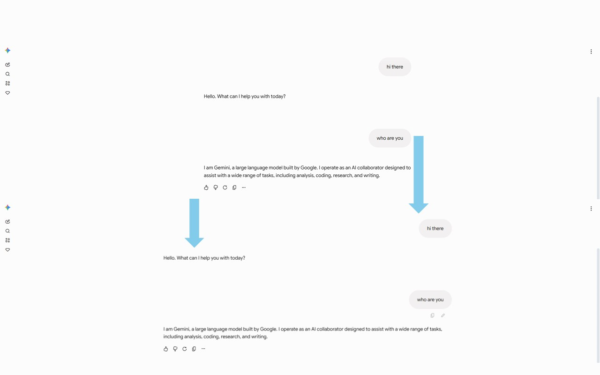

[English](../../README.md) | [简体中文](../../README.zh-CN.md) | 繁體中文

# Wider Gemini

用來調整 Gemini 對話寬度的 Chrome 擴充功能。拖曳滑桿或點選預設，就能把對話區調到適合自己螢幕的大小。

[](https://chromewebstore.google.com/detail/apadogadaahdjhhmbdhkmdecbobijoed?utm_source=github&utm_medium=readme&utm_campaign=zh-tw)
[](https://github.com/Planetes1mal/wider-gemini/releases/tag/v2.8.0)
[](../../LICENSE)



上：預設寬度。下：使用 Wider Gemini 加寬後的對話區。

## 功能

- **調整寬度**：以像素（`px`）或視窗比例（`%`）設定，也可以儲存常用預設。
- **調整字型大小和間距**：字型大小支援 75%–200%，行高和段落間距可以分別設定。
- **程式碼自動換行**：較長的程式碼會在對話區內換行顯示。
- **使用者訊息填滿寬度**：讓自己的訊息和 Gemini 的回覆一樣，靠左對齊並使用完整的對話寬度。
- **介面語言**：英文、簡體中文、繁體中文、韓語、日語和西班牙語。預設跟隨瀏覽器，也能手動選擇。韓語、日語和西班牙語採用機器輔助翻譯，歡迎母語者改進。

設定會自動儲存，調整後立即套用至已開啟的 Gemini 頁面。

## 安裝

在 [Chrome 線上應用程式商店](https://chromewebstore.google.com/detail/apadogadaahdjhhmbdhkmdecbobijoed?utm_source=github&utm_medium=readme&utm_campaign=zh-tw)點選 **加到 Chrome** 即可安裝。

GitHub 版本與 Chrome 線上應用程式商店的更新時間可能不同。若要使用 2.8.0，請依下方方式安裝對應的 GitHub 正式版。

<details>
<summary>手動安裝</summary>

1. 到 [GitHub Releases](https://github.com/Planetes1mal/wider-gemini/releases) 下載最新正式版的 `wider-gemini-*.zip`。
2. 解壓縮至固定位置，確認資料夾內有 `manifest.json`。
3. 開啟 `chrome://extensions/`，開啟右上角的 **開發人員模式**。
4. 點選 **載入未封裝項目**，選取剛才解壓縮的資料夾。

若曾手動安裝 2.8.0 候選版，請替換檔案並重新載入擴充功能，以使用正式版；候選版不會自動升級為此版本。

</details>

## 使用

1. 開啟 [Gemini](https://gemini.google.com/)，點選瀏覽器工具列中的 Wider Gemini 圖示。
2. 選擇 `px` 或 `%`，拖曳寬度滑桿，也可以直接點選預設。
3. 視需要調整字型大小、閱讀密度，或開啟程式碼自動換行。

在 **管理預設** 中可以修改預設名稱和寬度；`px` 和 `%` 各有一組獨立預設。介面語言可在彈出視窗底部切換。

使用長文閱讀、表格、程式碼和大字四種**任務預設**時，先查看設定摘要，再點選套用；**還原先前設定**可在本機恢復套用前的版面，關閉彈出視窗後仍可使用。具體數值及還原範圍見[閱讀指南](../guides/reading-layout.zh-TW.md)。

彈出視窗底部的 **說明與回報** 提供疑難排解，也可以預覽並複製診斷設定。擴充功能支援 Gemini 網頁和透過 Chrome 安裝的網站應用程式視窗，不會修改原生桌面應用程式或 Chrome 內建的 Gemini 面板。

## 隱私權

擴充功能只在 `gemini.google.com` 上調整頁面樣式，不收集或上傳對話內容，也沒有統計或追蹤服務。

偏好設定透過 Chrome 的擴充功能儲存空間保存；是否跨裝置同步取決於你的瀏覽器同步設定。詳見[隱私權說明](../PRIVACY.md)。

## 本機開發

本專案使用原生 JavaScript、HTML 和 CSS，無須安裝相依套件或建置。

```bash
git clone https://github.com/Planetes1mal/wider-gemini.git
```

在 `chrome://extensions/` 開啟 **開發人員模式**，點選 **載入未封裝項目**，選取儲存庫資料夾。修改程式碼後，重新載入擴充功能並重新整理 Gemini 頁面。

內部迭代可執行 `node scripts/test.js --skip-packaging`，執行現有單元檢查而不產生 ZIP。瀏覽器與發佈檢查見[貢獻指南](../../CONTRIBUTING.md)，版面規則見[工程與相容性說明](../engineering.md)。

[附日期的相容性記錄](../compatibility.md)區分原始碼實測和待驗證裝置。執行 `node scripts/reading-lab.js` 可開啟[本機閱讀實驗](../lab/README.md)，比較正文與表格的兩種寬度安排；它獨立於擴充功能。

## 回報問題與貢獻

遇到問題，可在彈出視窗的 **說明與回報** 中複製診斷設定，並附上操作步驟提交 [Issue](https://github.com/Planetes1mal/wider-gemini/issues/new/choose)。分享螢幕截圖前請移除私人資訊。歡迎提交 Pull Request。

如果 Wider Gemini 對你有幫助，可以在 GitHub 點一個 Star，讓更多人發現它。

Star 完全自願。想接收版本通知，請使用儲存庫的 **Watch → Custom → Releases** 設定，參見 [GitHub 通知說明](https://docs.github.com/en/subscriptions-and-notifications/get-started/configuring-notifications)。

本專案採用 [MIT 授權條款](../../LICENSE)。
